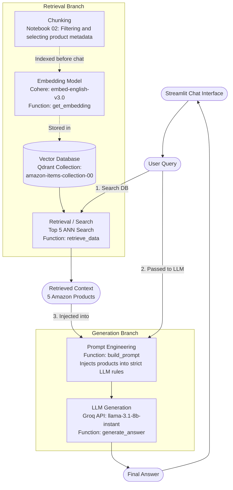

# AI-Engineer: Amazon Shopping Assistant 🛍️

Welcome to the **AI-Engineer** project! This is a full-stack, AI-powered chat application that acts as an intelligent shopping assistant for Amazon products. 

At its core, this project utilizes a **Retrieval-Augmented Generation (RAG)** pipeline to answer user questions using a private database of products, rather than relying solely on the AI's general knowledge.

Below is a detailed breakdown of how the RAG architecture works in this project.

## 🧠 RAG Architecture Map

This diagram visualizes the flow of data from the moment a user asks a question to the moment the AI generates an answer.

## 📖 Step-by-Step Concept Breakdown

Here is exactly what is happening in the diagram above, explained step-by-step:

### Phase 1: Preparation (Done before the user chats)
Before the AI can answer any questions, it needs a brain full of product knowledge.
1. **Chunking**: We start with raw Amazon datasets. We "chunk" this data by cleaning it up, filtering out products without images, and extracting only the most important details (like the title, price, and description).
2. **Embedding**: Computers can't easily search raw text for "concepts," but they can search math. We use the **Cohere (`embed-english-v3.0`)** model to convert the text of every single product into an "embedding"—a long array of numbers representing the conceptual meaning of that product.
3. **Vector Database**: We upload all those products and their math arrays into **Qdrant**, our Vector Database. Qdrant is optimized to store and instantly search through millions of these embeddings.

### Phase 2: Retrieval (When the user asks a question)
1. **User Query**: The user types a question into the Streamlit chat interface (e.g., *"Can you recommend a cheap phone charger?"*).
2. **Search**: The backend takes that question, instantly converts it into numbers using Cohere, and asks Qdrant to find the 5 closest matching products. Qdrant performs an **ANN (Approximate Nearest Neighbor)** search to pull the top 5 most relevant products from the database.

### Phase 3: Generation (Formulating the answer)
1. **Prompt Engineering**: We take the 5 products that Qdrant found (`Retrieved Context`) and glue them together with the user's original question into a giant set of strict instructions. We tell the AI: *"You are an Amazon shopping assistant. Answer the user's question using ONLY these 5 products."*
2. **LLM Generation**: We pass that giant set of instructions to the **Groq API (`llama-3.1-8b-instant`)**. Because we provided the exact context, the AI doesn't have to guess or hallucinate—it simply reads the 5 products we handed it and generates a perfect, conversational answer.
3. **Final Answer**: The final generated text is sent back to the Streamlit UI and displayed to the user!
