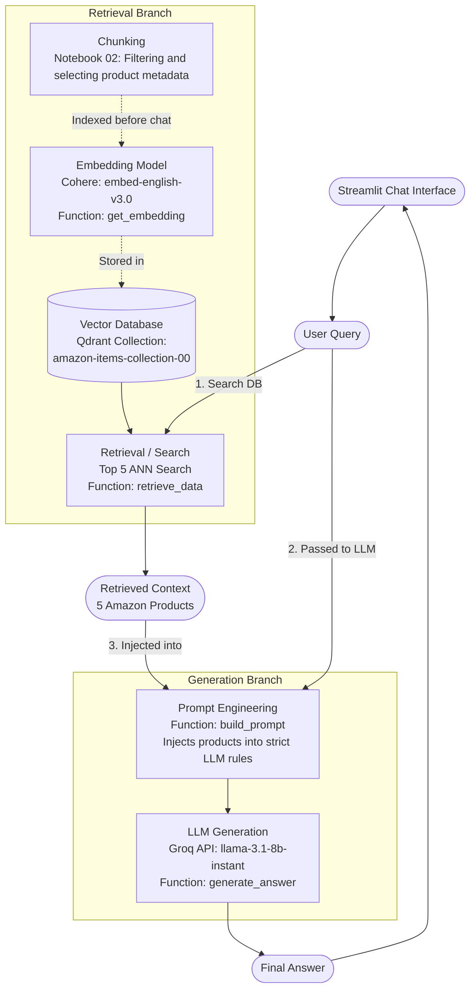

# RAG Architecture Map

This diagram visualizes the Retrieval-Augmented Generation (RAG) architecture specific to the `ai-engineer` project. It maps the standard RAG concepts (Chunking, Embedding, Vector Database, Prompt Engineering) to the actual tools and functions used in the codebase.

### How the flow works during a real chat:
1. **User Query:** A user types a message into the Streamlit interface.
2. **Retrieval:** The FastAPI backend sends that text into the **Retrieval Branch**. `get_embedding()` turns the text into numbers using Cohere, and `retrieve_data()` searches Qdrant for 5 matching products.
3. **Prompt Engineering:** Those 5 matches (`Retrieved Context`) are sent over to the **Generation Branch**, where `build_prompt()` glues them into a giant string of instructions with the user's original query.
4. **Generation:** Finally, `generate_answer()` passes that formatted string to the Groq LLM, which spits out the final conversational response that appears on the user's screen.
